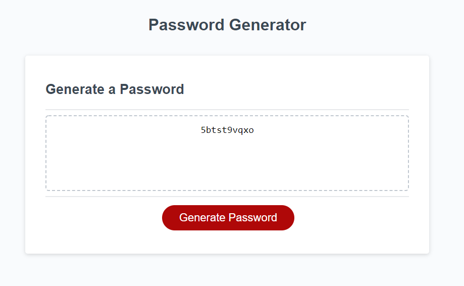

# Random Password Generator
### Homework 03 - Topic: Javascript
### Author - Joseph Pugmire

This is a password generator that prompts the user for the length and what types of characters they'd like it to contain.

### Screenshot

##[Deployed Link](https://jpugmire.github.io/js-hw-03/)
